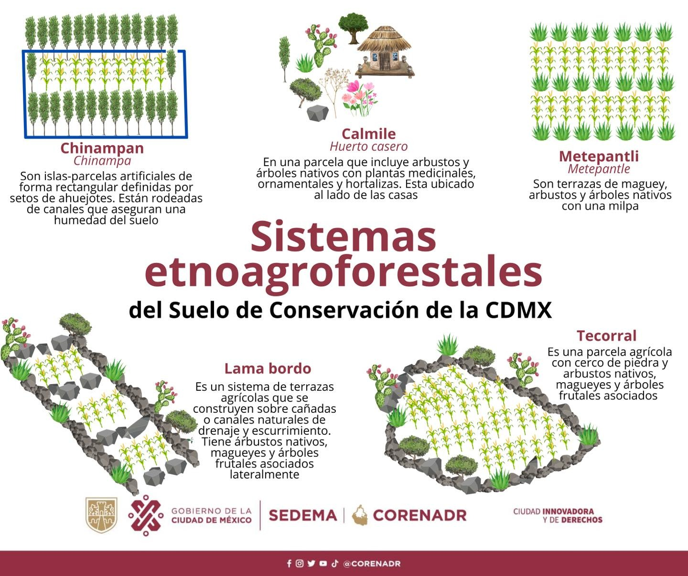

Actualizado 2 de septiembre 2024 
Realizado trás la visita y actividad en el paraje el agüita.

# Presupuesto hidrológico

El agua es el recurso material abiótico más preciado que tenemos: se ocupa para los procesos de las funciones del ecosistema, del ambiente que nos permite la existencia material.

Las plantas utilizan el agua no solo para beberla, transpirar y jalar más nutrientes del jugo del suelo, sino para formar los mismos fotosintatos (compuestos derivados de la fotosíntesis) que mandan a las raíces para intercambiar con la vida en el suelo, la cual también ocupa el agua.

Específicamente, el agua permite la vida en el suelo, pues forma un ambiente semiacuático en los poros del mismo, donde las miriadas de micro, meso y macroorganismos conviven realizando las funciones como:

**Nutrientes**
- Extracción (minar del material primario y de la materia orgánica)
- Inmobilización (previene a que no se deslave con la lluvia)
- Traslocación (las micorrizas y organismos móviles trasportan nutrientes a través o con de sus cuerpos y los primeros los intercambian con la raíz por fotosintatos)
- Reciclaje (cada vez que uno se come a otro, los microestiércoles hacen la función de microabono; esto es, en gran parte, como las plantas obtienen nutrientes sin fertilizantes, puesto que hay incontables microabonos en la cercanía de las raíces. En caso de que la planta no lo use, otro microorganismo lo agarra: inmobilización)
 
Si hay agua insuficiente estos procesos se detienen, junto con la productividad del agroecosistema. Naturalmente lo más sensato en un sentido econológico es procurar aprovechar al máximo esta agua, que, a una escala de parcela, es literalmente la que cae del cielo. Ese es el presupuesto hídrico de la parcela. Cualquier gota de agua extra, se trajo de otra parcela, de otro terreno, de otro tiempo (ahorros, del subsuelo)  porque este no fue exitoso en retenerla, la perdió.

Ahora bien, si idealmente hasta la última gota de agua que cae del cielo se utiliza en el mismo metro cuadrado donde cayó -principalmente por las plantas vía transpiración-, de forma práctica no es posible en muchos casos, no obstante, se puede llegar al potencial técnicamente posible en funión de la pendiente, naturaleza del suelo, clima, manejo que le dan los humanos, etc.

Naturalmente, los mismos organismos del suelo (conocidos en conjunto como edafón) procuran su misma subsistencia y maximizar su productividad, trabajando en conjunto con las plantas, reacomodan las partículas del suelo (en grumos o moronas, conocidas como *agregados*) para favorecer:

- la capacidad del suelo para retener agua, como una esponja (ejemplo: mililitros de agua de lluvia por litro de suelo)
- la velocidad a la que el suelo puede absorber o *infiltrar* agua que cae del cielo
- el amortiguamiento de la gota que se precipita a la superficie, previniendo la compactación de la capa superficial del suelo, lo que merma el primer punto de esta lista

 **Izquierda - agregados en el suelo ; Derecha ilustración de agregados | crédito: Maureen Sundberg - https://www.ecolandscaping.org**
 

 **Suelo que tiene estrctura agregada, pero perdió su cobertura y le impacta de forma directa la gota de lluvia, compactandolo en la superficie previniendo la infiltración, produciendo escorrentía superficial que erosiona aún más suelo**

Este mismo efecto de *agregar* el suelo tiene pegamentos que lo mantienen estable y más resistente a la presión de la superficie. Empero, cuando se remueve el suelo mediante el arado, año tras año tras año, se agota la materia orgánica y esta agragación y pegamentos ya no funcionan, queda el suelo pulverizado, como para hacer ladrillos.

 **Prueba de desleimiento: izquierda -  suelo en recuperación sin arar con manejo regenerativo -apenas se desmorona un poco- ; derecha - suelo arado año con año de forma convencional -se desmorona y colapsa completamente-  | crédito: Maureen Sundberg - https://www.ecolandscaping.org**

Es por ello que para maximizar la captura de agua hay que tener el suelo cubierto, con plantas (raíces y microorganismos asociados) y/o reastrojo/acolche, para amortiguar la caída de la gota. De esta forma se maximiza el aprovechamiento de agua.

 **Arvenses sobre el lomo amortiguan la caída de la gota, mejorando la captación de agua al centímetro cuadrado. Podría ser aún mayor si tuviera rastrojo como acolche. El fondo del surco tiene menor cobertura y está relativamente desprotegido. Milpa en la cercanía de el paraje el agüita**

Otro beneficio de que el suelo sea como una esponja es que este libera poco a poco el agua (también mejora el drenaje, previniendo el anegamiento), contribuyendo a sobrellevar el cambio climático (lluvias mas fuertes pero mas cortas) y alargando el tiempo que duran las corrientes intermitentes.

# Agricultura en ladera

**Milpas en pendiente muy pronunciada en el paraje el agüita**

Generalmente se considera que la agricultura es en ladera cuando la pendiente del terreno es de 8% o superior. Estos terrenos tienen un mayor riesgo de erosión del suelo si este se mantiene descubierto o se perturba, por ejemplo, ejerciendo el arado.

Una gran proporción (alrededor del 40%) de la agricultura campesina se realiza en parcelas con estas características. El uso de prácticas convencionales conlleva a una pérdida de suelo y agua no deseable, hasta risgosa, empero, es en estas mismas parcelas donde tiende a preservarse mayor diversidad de los cultivos y de las arvenses, donde ha llegado menos la tecnificación y el uso de agroquímicos.

 **Milpa en pendiente pronunciada. Nótese el contraste entre el lado derecho -suelo de bosque cubierto con acolche de hoja- y el lado izquierdo, arado, colapsado, saturado (drenaje mejorable) de la reciente lluvia. cercanías del paraje el agüita**

Es entonces que surge la necesidad de desarrollar y socializar estrategias que permitan conciliar la productividad (por necesidad) y la consercación del suelo y agua. Esta línea de investigación tiene aún mucho por desarrollarse, sin embargo, hay que recordar que lo más recomendable, desde una persectiva ecológica, que omite el componente social, es no realizar agricultura en estas pendientes y minimizar el tráfico que por ellas pasa. Más adelante se explicarán estrategias para esta *feralización* de parcelas en pendiente.

# Surcos

En el caso de milpa o donde se utilicen zurcos y lomos, se recomienda solo implementarles, de ser absolutamente necesario (por manejo de arvenses, etc.), en pendientes no tan pronunciadas, y evaluar la posible existencia de un *pié de arado*, que es una capa de suelo compactado derivado de las operaciones de arado convencionales.

De existir, se recomienda (en estas pendientes la operación del tractor es viable) realizar un subsoleo con el arado *yeomex* o similar, de acuerdo al patrón de línea clave o contrapendiente, para garantizar un drenaje suficiente y prevenir anegamiento (en temporada de estiaje para prevenir la formación de capa impermeable cuando pasa el implemento). Tras esta operación, se puede realizar un arado de discos/rastra y hacer los surcos en el mismo patrón que el subsoleo.

De preferencia, este arado sería el último, para dar paso a técnicas de cero o mínima labranza. Caso que se vería indispensable en pendientes pronunciadas y muy pronunciadas.

Es importante mantener cubierto el suelo con rastrojo. Si se le deja pelón queda vulnerable a la inclemencia del sol y el azote de la lluvia. Una capa de media, hasta una pulgada es trabajable en cultivos anuales. Es sabido que el rastrojo se les da a los animales, empero, también hay que reinvertirle materia orgánica al suelo. No hacerlo es abusar del mismo y desgaste del patrimonio que es.

# MIAF

La Milpa Intercalada con Árboles Frutales es una estrategia ya madura, implementable en pendientes inexistentes hasta medianamente pronunciadas, donde las parcelas son amplias, con muchos surcos, pues si son estrechas y hay pocos surcos no alcanza el espacio para todo.

El sistema consiste en tener bandas de 2 o 3 metros de ancho en el mismo sentido que los surcos (línea clave o contrapendiente) de árboles frutales y otras plantas perennes (manzanos, duraznos, nopales, magueyes, etc.) Los árboles o plantas perennes se trasplantan en el espaciamiento habitual que corresponda a la naturaleza de la planta y del manejo que se le planee dar (con poda, sin poda, etc.). Enre cada banda normalmente hay entre  30 y 40 surcos.

En pendientes muy empinadas apenas habría unos surcos entre las bandas de árboles, por lo que no es viable en pendientes muy pronunciadas.

 **Ilustración conceptual del sistema MIAF. Nótese que esa pendiente esta exagerada. Crédito Programa Sembrando Vida - Gobierno de México**

En el caso de realizarse en pendiente, entre los frutales y perennes anteriormente mencionados, se trasplantan de forma muy cercana plantas que rebrotan tras la poda, con el objetivo de crear una barrera que detenga o realentice las escorrentías y los sedimentos que arrastre. Las podas se colocan en la cercanía del pié de las plantas, hacia arriba de la pendiente. En el raro caso de que sobraran rastrojos (más de una pulgada de profundidad) aquí también se ponen.

Conforme los árboles van creciendo, las plantas para poda se les restringe más y más hasta que no se recuperan.

 **Izquierda - (1) zurcos a contrapendiente | Derecha - MIAF en pendiente. Nótese (3)  la pila de podas y rastrojos sobrantes cercano al pié de los (2) árboles, hacia arriba de la pendiente. Nótese también que la pendiente es relativamente moderada. Crédito Cortés, Turrent, et. al. COLPOS https://www.colpos.mx/wb_pdf/Transparencia/cde/2021/cde_diciembre2021.pdf**

 **Diseño de sistema MIAF en terrenos con pendiente pronunciada 20 a 40% | Manual para el establecimiento y manejo del MIAF en laderas José Isabel Cortés et. al. COLPOS 2005**

# Propuestas por experimentarse

Como se menciono anteriormente, el desarrollo de estrategias que concilien productividad y laderas tiene mucho por desarrollarse, por lo que en esta sección se abordarán propuestas que se estima tendrán efectos positivos a la vez de que sean pragmáticas y apropiables. La única forma de saberlo es poniéndolo a prueba.

## MIS - Milpa Intercalada con Seto

Una alternativa al MIAF en pendientes más pronunciadas o estrechas (con pocos surcos). En lugar a bandas de dos o tres metros, el ancho es el mismo que un lomo con maíz, en lugar de árboles frutales, se utilizan árboles nativos de rápido y lento crecimiento, que toleren la poda severa y tengan rebrotes. Se trasplantan muy cercanamente formando la barrera, se mantienen podados a un metro de altura (para permitir la luz al maíz.) y con una densidad de una rama viva vertical por cada 10 - 20 cm.

 **Suelo clareado en una pendiente muy pronunciada, presenta gran vulnerabilidad a la erosión. Parcela en las cercanías al paraje el agüita.**

Hacia arriba en la pendiente se siembran herbáceas perennes como dalias silvestres, salvias, etc. o arbustillos (ej. perlita), como capa adicional y redundante.

Dependiendo de  la densidad de ramas verticales, se puede colocar también enredaderas perennes como chayote o vid.

Este seto proporciona, además de retención de suelo y agua, hábitat para polinizadores y otros organismos benéficos. Empero, es patente que este sistema requiere alto mantenimiento en forma de poda.

Adicionalmente, el usar árboles de rápido (ej, aile, tepozán, fresno, capulín, álamo, ólmo, colorín, tejocote) y lento crecimiento, como encino, que es ectomicorrícico, permite también el aprovechamiento de hongos comstibles del tipo ectomicorrícico, y de las podas del tipo saprótrofo.

 **Tepozán podado casi a a rás de tierra con reborte vigoroso cerca de una milpa en el paraje el agüita. De todos esos rebrotes Se tendría que seleccionar solo un, dos o hasta tres rebrotes; los más fuertes.**

![Sistema MIS - Milpa Intercalada con Seto | En pendeintes pronunciadas y en parcelas estrechas no hay espacio para los árboles frutales; Se utiliza un seto muy estrecho y denso con plantas leñosas que toleran poda severa y rebortan. Se complementa con perennes herbáceas como dalia silvestre y salvias nativas. Las podas se amontonan cerca del pié del seto, se inocula con hongos comestibles. Si hay espacio se complementa con enredaderas como chayoye o vid. Se mantiene a 1 m de alto. El sistema requiere de manejo intensivo en forma de poda. | A - vista lateral ; B - vista frontal. ](MIS_ma.png) **Sistema MIS - Milpa Intercalada con Seto | En pendeintes pronunciadas y en parcelas estrechas no hay espacio para los árboles frutales; Se utiliza un seto muy estrecho y denso con plantas leñosas que toleran poda severa y rebortan. Se complementa con perennes herbáceas como dalia silvestre y salvias nativas. Las podas se amontonan cerca del pié del seto, se inocula con hongos comestibles. Si hay espacio se complementa con enredaderas como chayoye o vid. Se mantiene a 1 m de alto. El sistema requiere de manejo intensivo en forma de poda. | A - vista lateral ; B - vista frontal.**

[Abrir imágen en grande](MIS_ma.png)

### Terraza con muro vivo

Prácticamente sinónimo del MIS, pero con árboles frutales. Adicionalmente, el rastrojo se coloca hacia arriba de la pendiente como materal para el filtro de escurrimientos.

 **[MIAF en terraza con muro vivo | Manual para el establecimiento y manejo del MIAF en laderas José Isabel Cortés et. al. COLPOS 2005**

### Tecorral

En lugares pedregosos, a cualquiera de estas versiones se agregan piedras sobrepuestas. Alternativamente a las plantas propuestas, se puede usar nopales tuneros, magueyes, etc.

## Cero labranza

¿Cómo mencionar no mover el suelo cuando de forma tradicional (desde la colonia) este ha sido el manejo que se le dá? La labor o aporque.

Año con año se pasa para mover de aquí a allá, para aflojar, para tapar arvenses. Así se ha hecho desde que se tiene memoria y la postura general es que no hay de otra.

No obstante, en otros países la cero o mínima labranza está ganando terreno. Muchas veces esto es posible gracias al sobre-precio del que gozan los bienes comestibles con la etiquta de *orgánico*.

  **Terrón con estructura agregada y lombrices de en un sistema cero labranza donde se cultiva maíz y cebada | Credito Amador Aguillón https://www.facebook.com/amador.aguillon.1 **

Este es sin duda uno de los más grandes obstáculos de la implementación a mayor escala de una agricultura agroecológica, que no se permite externalidades que faculten, como al maíz de E.E.U.U., vender la cosecha a un costo menor al real.

Por ahora la única alternativa es hacer más cortas las cadenas de producción-consumo a través de organizaciones de productores que surtan de forma directa a redes de consumidores.

Volviendo al contexto de la parcela, dado el contexto de la implementación internacional de la cero o mínima labranza, se invita a interpretar el arado como una herramienta más en la caja de herramientas, entre otras. 

Esta herramienta produce varios efectos, entre los que se encuentran:

- incrementar el riesgo y velocidad de pérdida de suelo (erosión)
- *quemar* la materia orgánica del suelo, disminuyendo su capacidad (al terminar la temporada de lluvias) a largo plazo de captar y almacenar agua como si fuera esponja.
- sacar semillas de arvenses a la superficie, donde les da el sol y por eso germinan (el arado promueve la emergencia de arvenses, puede verse como un mecanismo natural de reparación del suelo desnudo)

En el contexto de laderas, especialmente las pronunciadas, el riesgo y la velocidad de pérdida de suelo son mayores, por lo que es donde sería de mayor impacto e importancia, desde una perspectiva de función ecológica e hidrológica, preferentemente cesar las actividades agrícolas. Si estas han de continuar, lo más funcional en términos ecológicos es una agricultura que, en la medida de las posibilidades, maximice la función del suelo y la capacidad de capturar y retener agua.

En el contexto de laderas pronuciadas, la cero labranza sería el manejo de suelo ideal. Para esto, hay que tener presente temas que eran de menor importancia con el arado:

### Compactación

Con el arado no importa pues al siguiente año se vuelve a aflojar el suelo de forma mecánica. En el caso de la cero labranza y labranza mínima, esta tiene que prevenirse a toda costa. Ya se mencionó que el suelo desnudo permite la compactación por las gotas de lluvia, por lo que hay que procurar mantenerlo cubierto con residuos vegetales y plantas vivas. Más adelante se abordará el como.

Adicionalmente, otro factor que produce compactación y pérdida de cobertura vegetal y acolche es el tráfico de personas y máquinas, por lo que este también ha de prevenirse y amortiguarse. 

Finalmente, el descompactar el suelo, que con el arado se hace de forma mecánica, de manera *natural* y *lenta*, se hace con las raíces, luego llegan las lombrices naivas, los bichitos del suelo que hacen tunelitos.

#### Compactación por tráfico

El paso de la llanta del tractor o la zuela del calzado ejerce una fuerza sobre el suelo que produce un efecto de compactación. Este efecto es más marcado cuando el suelo tiene humedad. Esta compactación reduce la porosidad del suelo, efectivamente afectando su capacidad de infiltración y de intercambio de gases, produciendo un cambio en la dinámica de los orgranismos del suelo, hacia un modo anaeróbico, que no es sano para las raíces.

Es entonces, que es de suma importancia prevenir que suceda esta compactación, para lo cual hay dos estrategias:

- Tráfico controlado, en el que el calzado y las llantas solo pasan por áreas muy específicas y delimitadas, compactándose mucho, pero dejando las demás áreas sin afectar
- Disribución del peso, en el que el peso del objeto o entidad sobre el suelo se distribuye más para que la fuerza por cada centímetro cuadrado sea menor, y cause menos afectación.
- Combinación de las dos anteriores
- Flotación o aéreo: Reducir la fuerza ejercida sobre el suelo de forma total flotando sobre el mismo mediante impulso por aspas como en los drones, o mediante cámaras de has más lígero que el aire como helio (sin aplicación práctica conocida)

Es entonces, que de la combinación de la primera y de la reversión con raíces, surge la idea de los senderos gemélos. 

### Reciclaje de nutrientes

En el arado, al aflojar demasiado la tierra, los microorganismos del suelo se ponen hyperactivos y *queman* la materia orgánica del suelo, liberando los nutrientes que en esta se encontraban. Pero esto es como si cada año quemáramos la casa para cocinar una cena. 

En un suelo funcional, como el del bosque, donde nadie fertiliza y el lento movmiento del suelo como el que hacen las lombrices y los bichos, la disponibilidad de nutrientes se dá por que los microorganismos, microbichitos y bichitos poco a poco mas grandes se comen unos a otros, dejando microabonos que la planta aprovecha.

Es entonces que lo que se tiene que procurar es esta red de microorganismos y bichitos, en su conjunto conocidos como la red trófica del suelo o edafón, para que le surtan de nutrientes a nuesros cultivos.

Adicionalmente, al  bosque se le cosecha muy poco, mientras que a la parcela cultivada se le llega a cosechar, cuando nos llevamos el rastojo, hasta el 90% de la materia vegetal que se produjo.

Es entonces que para compensar estas cosechas tan grandes en comparación con lo natural, se ocupa reponer constantemente los minerales que vienen en lo que se cosecha. 

Para procurar el edafón y para reponer los minerales se ocupan un par de herramientas de nuestra caja, ambos considerados como biopreparados.

En el caso de procurar el edafón, lo que se recomienda es 

- una vermicomposta, pero esta, en lugar de ser de estiércol no más, esta se hace predominantemente (60%) con materiales leñosos o rastrojos secos, 30% de materia vegetal fresca y hasta 10% de estiércol líbre de químicos como desparasitantes que le dan al ganado. 
- Microorganismos de montaña líquidos.
- Inoculante Johnson-Su.

En el caso de los preparados sólidos, ya que estan listos, se extraen en agua y se aplica como drench y como parte del empanizado de la semilla.

En el caso de los minerales, la primera recomendación es reciclar los esiércoles, sean de animal y de humano también. En el caso de este último, la sanidad es de la mayor de las importancias, por lo que se recomienda el modelo Jenkins de *retrete seco* y *estación de compostaje* [The humanure handbook]().

De forma paralela, el uso de harinas de roca complementaria (al perfil mineral del suelo local) y/o sales químicas disueltas por microorganismos de montaña líquidos en forma de foliares y drech, de acuerdo a la etapa fenológica del cultivo,  coadyuva a maximizar la productividad de los cultivos.

### Rotación y descanso de la tierra

En la naturaleza del suelo, no hay descanso: es una ciudad gigantesca de microorganismos y bichos, que mientras haya agua, aire y raíces trabajan sin parar, pero el día que falta alguno de estos es cuando paran las labores. Mientras más les den las raíces, mas casa, edificios, carreteras, caminos construyen, pero estan hechos de matera orgánica, incrementando la capacidad de almacenar agua y nutrientes.

Es por eso que en agricultura regenerativa se procura tener una planta cubriendo el suelo el mayor tiempo que sea posible, para que haya raíces,agua, aire y microorganismos y bichitos trabajando y haciendo más poroso el suelo.

El cambiar de un tipo de planta a otra también ayuda a prevenir la acumulación de enfermedades y plagas en el suelo, así como darole un cambio a los bichos del suelo.

Para hacer estas dos cosas, se utilizan los cultivos de cobertura o de servicio, cuyo trabajo es capturar la energía del sol, seguir echando raíces, y bombeando exudados que alimentan la vida en el suelo, mejorandolo, y romper el ciclo de las plagas y enfermedades. 

El campo de los cultivos de cobertura esta parcialmente desarrollado (especialmente en E.E.U.U. ), y ocupa mucha investigación y desarrollo para adaptarlo a los contextos nacionales y locales. En algunas regiones, donde neva o hace bastante frío y llueve lo suficiente, alternan dos fases: de abril o mayo hasta septiembre - octubre (llamemosle cálida) y los meses opuestos (llamemosle fría).

Se pondrán de ejemplo dos casos:

#### Cultivo principal en temporada cálida

En abril o mayo se le da término al cultivo de cobertura que creció en la temporada fría, por medios mecánicos u otros. El material vegetal se acama y, bajo este acolche que queda, se siembra la semilla del cultivo principal (ej. maíz, frijol, haba, etc.). El acolche previene la emergencia de arvenses, permitiendo la emergencia del cultivo principal.

El cultivo principal se maneja de forma normal con abonos, foliares, manejo de plagas y enfermedades. Las arvenses no toleradas se manejan de forma mecánica o con aspersión de microorganismos líquidos concentrados.

al llegar a la madurez fisiológica del cultivo principal, este se cosecha y se siembra el cultivo de cobertura, por ejemplo centeno y/o ebo. Estos se desarrollan, toleran el frío y las heladas, llega la primavera y a repetir el ciclo, se les da término, impidiendoséles producir semilla, para mantener esos nutrientes en el suelo y el acolchado.

 **Ebo bajo maíz. Al cosechar el maíz el ebo seguirá creciendo durante el resto del invierno y primavera con la humedad residual. | Crédito Amador Aguillón https://www.facebook.com/amador.aguillon.1**

 **Roladora 'roller-crimper' dando término a un cultivo de maíz | Crédito Rodale Institute**

  **Siembra de cero labranza. Semillas emergiendo entre el residuo de trigo. | Crédito Kevin Gross https://www.facebook.com/groups/154480008227557/user/100002621636346**

 **Terminación manual  de cultivo de cobertura por 'rolling-crimping' en cama | Crédito https://www.instagram.com/adamafarm/**

 **Cultivo de maíz trás un cultivo de cobertua de centeno al que se le dió térmico con el *roller-crimper*. Residuos forma una 'alfombra' que previene la emergencia de arvences. | Crédito 'Everything Cover Crops' https://www.facebook.com/groups/154480008227557**

De esta forma, en zonas específicas del los E.E.U.U. alternan o rotan entre cultivo principal y cultivo de cobertura.

Naturalmente, si se tratara de implementar este mismo sistema nos enfrentaríamos a muchas cosas que no cuadran en nuestro contexto. Por ejemplo, nuestros maíces no son de ciclos tan cortos, no llueve tanto, va aquedar muy seco el suelo para el siguiente ciclo, etc. Es por esto que falta muchísima investigación, desarrollo y socialización de estrategias que nos permitan hacerlo.

De forma preliminar, puede intentarse con el centeno y el ebo, sembrando en cultivo principal verde, apodando las arvenses, dándoles término cuando se sequen por falta de agua o cuando se juzge prudente para conservar humedad. El momento más fácil para darles término es cuando estan en floración y antésis, basta con quebrarles el tallo en la base y mueren. Para esto hay implmenentos para hacerlo con tractor y de forma manual.

#### Cultivo comercial en temporada fría

De forma alternativa, en la temporada cálida se siembra uno o una mezcla de cultivos de cobertura como girasol, sorgo, cempasúchil, avena, etc. para mejorar el suelo, y llegado septiembre-octubre se les da término, se acaman, y se siembra el cultivo principal de invierno, como brassicaceas, trigo, cebada, etc.

#### Rotación simultanea en temporada de lluvia

Otra alternativa es rotar de forma silumtánea el cultivo principal con el de cobertura, asignándole una superficie a cada uno. Eso implica que esa parte de la parcela que se alterne con cultivos de cobertura no producira bienes, por lo que se ocupa estar muy atento a los puntos críticos de influencia de los cultivos con foliares para maximizar su productividad. A cambio, los cultivos de cobertura mejoraran el suelo par el cultivo principal el proximo año, dejando materia orgánica y micrrorganismos prestos para cuando llege el cultivo principal.

 **Rotación de cultivos en un sistema de cero labranza. A - párcela entera sembrada con ebo y centeno durante la temporada fría | B - ebo y centeno solo enlos pasillos para revertir la compactación por tráfico | C - Rotación de filas maíz+ frijol con haba | D - Rotación simultánea en temporada de lluvia maíz + frijol con mezcla de cultivo de cobertura girasol, avena, nabo forrajero, frijol caupí**

#### Arvenses toleradas en la milpa

La mezcla de maíz, frijol, calabaza y arvenses toleradas (mientras más y distintas, mejor), ya proporcionan ese efecto de *rotación* por lo que lo que habría que buscar es mantener esa diversidad de la milpa tradicional, de ser posible sin mover el suelo o muy poco y de forma localizada.

#### Evolución progresiva hacia un manejo que conserva el suelo y el agua

El reactivo limitante en estas estrategias es la herramienta de siembra en un suelo sin arado, a través del residuo. Es aquí donde las instituciones del estado y privadas pueden dedicar esfuerzos, a través de la investigación y desarrollo, para poner a disposición de los posesionarios de la tierra todo lo necesario para darle un manejo adecuado de acuerdo a su naturaleza de suelo de conservación.
refo
Sin embargo, se puede empezar dejando arvenses toleradas (y ampliar el espectro de arvenses toleradas) para proteger el suelo, así como dejar el rastrojo en la superficie. Estas son estrategias implementables de forma inmediata que no requieren de equipo o implementación particular.

# Actividad de reforestación CORENADR

Parte del área donde se realizó la denominada reforestación, en opinión del autor, donde el estuvo, ya era un sistema bastante funcional, con cobertura de dosel mayor al 80%-90%, con amplia y diversa cobertura en sotobosque, con cobertura de hojarasca y suelo con estuctura agregada, amplia capacidad de infiltración y retención de agua: un suelo funcional.

---

### Área ya forestada, con amplia cobertura de dosel y sotobosque, donde se trasplantaron varios arbolitos

----

Durante el diálogo de retroalimentación se mencionó que la idea principal era reforestar el las inmediaciones del ojo de agua, donde se hizo una remoción completa de la cobertura vegetal. Lamentablemente el autor no estuvo en esa sección, ni parece haber forotgrafías en el gurpo del laboratorio ambiental. No obstante, si hay fotografías de zonas donde es de mayor relevancia y consecuencia ecológica e hidrológica el trasplante de arbolitos:

En estos claros donde se encuentra el suelo desnudo o incluso hay cobertura de hojarasca, generalmente ya tenían  una estructra de suelo agregada por lo que el trasplante entraría en condiciones ideles de suelo. Donde este no es este el caso, lo ideal, en cuanto a disponibilidad de horas-persona para el seguimiento de cada trasplante, es seguir el proceso de la sucesión ecológica, en el que las arvenses voluntarias o cultivos de cobertura van construyendo la estructura agregada y función del suelo, incrementando la predominancia fúngica entre los microorganismos del suelo.

 **Sucesión ecológica: tras una perturbación como un incendio, desmonte o arado, las plantas pioneras o arvenses ocupan el espacio, mejorando el suelo dando lugar a arbustos y árboles pioneros, para finalmente llegar a la comunidad climax del ecosistema. Crédito geeksforgeeks.org**

 **Parcela de avena en ladera, al fondo, una porción de la parcela fue abandonada, donde se empieza a dar el proceso de sucesión secundaria, lleno de plantas herbáceas, arbustivas y leñosas nativas que ocuparon el espacio. Atrás de estas, el bosque de encino maduro. Cercanías al paraje el agüita**

[Abrir la imágen en grande](grano_pequeño.png)

 **arbolito de encino que salió soilito, desde semilla, rodeado de plantas nativas espontáneas. Para mejorar su crecimiento y deempeño se puede gestionar el crecimiento de las plantas circundantes. Cercanía al paraje el agüita.**

En función del contexto y la disponibilidad de horas-persona y otros recursos, se recomendaría estrategias complementarias para maximizar la supervivencia de los árbolitos trasplantados. Entre ellas, es la inoculación con microorganismos nativos, entre ellos hongos micorricicos (del tipo que corresponda al trasplante: ecto y/o endo), así como adicionar acrilato de potasio o charolas guarda agua reutilizables.

 **Charorla guarda agua Groasis Waterboxx. Almacena agua y la libera lentamente para que el traspante apenas tenga disponibilidad, estimulando enraizamiento profundo.**

En zonas totalmente descubiertas, los métodos sintrópico y Miyawaki son alternativas potenciales.

## Senderos

 **Sendero vertical erosionado**

Dentro del componente forestal que el autor tuvo oportunidad de vistar dentro de y alrededor del paraje el agüita, las superficie que no era funcional en términos de suelo e hidrológico fueron los senderos, como en todos lados. 

Estos se dan por el tráfico contínuo que previene el crecimiento de plantas, lo que eventualmente produce la erosión. 

La estrategia que se propone a continuación es para prevenir que suceda este fenómeno, y consiste en redirigir los senderos para que no vayan en dirección de la pendiente, e incluso poner dos senderos paralelos para alternar el uso de uno y otro cada año, utilizando cultivos de cobertura en el que no se usa para prevenir la erosión y mejorar el suelo.

 **En lugar de hacer los senderos a favor de la pendiente, se hacen en contrapendiente, reduciedo la pendiente efectiva dentro del sendero.**

 **Senderos gemelos. Se usa uno de ellos un año mientras que el otro sendero se protege con cultivos de cobertura. El siguiente año se alternan y se deja el acolche como capa de protección extra.**

 **Segundo año alternado.**

 **Propuesta de adaptación de calzado para reducir la presión sobre el suelo análogo a las 'raquetas para nieve'. Placas sobre las que descansa el calzado. Debajo de las placas, arena compartementalizada seguida de zuela para tracción.**

 **Sendero vertical con una porción de erosión contralada con escalones de llantas rellenas de tierra, al lado, un camino en direción vertical con erosión intensa en progreso. Paraje el Aguita.**
